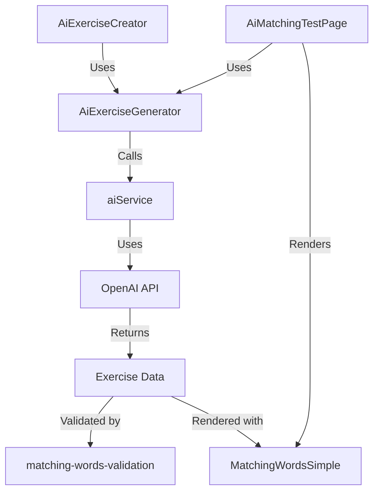
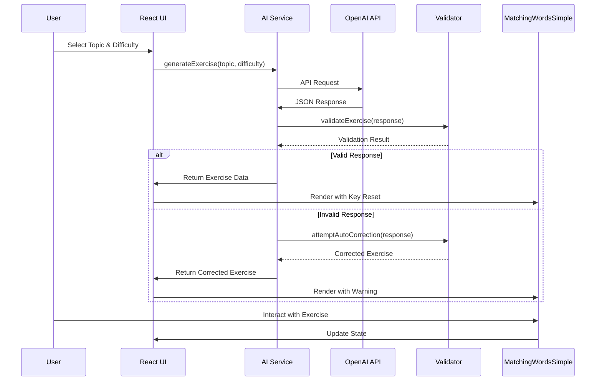

# Technical Integration Analysis: Merging AI-Powered Exercise Generation with Optimized React Components

**Author:** Alex Ex  
**Date:** March 29, 2025  
**Project:** LMS System  
**Focus:** Integration of AI Exercise Generation with Optimized Frontend Components

## 1. Executive Summary

This technical analysis examines the integration possibilities between:
1. AI-powered exercise generation system (developed by Alex Ex)
2. Optimized React component architecture (developed by Finny Frontend)

The analysis reveals complementary strengths that, when combined, would create a robust, maintainable system for generating and rendering educational matching exercises. This document serves as a knowledge base for implementing this integration, highlighting compatibility points, challenges, and specific technical approaches.

## 2. Current Implementation Analysis

### 2.1 Finny Frontend's Component Architecture

#### 2.1.1 Component Evolution

Finny developed multiple iterations of the matching words component, addressing state management issues:

1. **Original Component**: Suffered from infinite re-render loops due to circular state dependencies
2. **MatchingWordsFixed**: Initial attempt to fix circular dependencies
3. **MatchingWordsFinal**: More comprehensive solution with improved state handling
4. **MatchingWordsSimple**: Complete rewrite with cleaner architecture (recommended for production)

The evolution demonstrates a progression toward more maintainable state management.

#### 2.1.2 Key Technical Approaches

Finny implemented several React best practices:

```javascript
// Single Source of Truth Pattern
const [internalMatches, setInternalMatches] = useState({});

// Deep Comparison for Change Detection
useEffect(() => {
  if (JSON.stringify(prevStudentAnswersRef.current) !== JSON.stringify(studentAnswers || {})) {
    setInternalMatches(studentAnswers || {});
    prevStudentAnswersRef.current = studentAnswers || {};
  }
}, [studentAnswers]);

// Memoized Callbacks for Stability
const notifyParent = useCallback((newMatches) => {
  if (!readOnly && onAnswerChange) {
    onAnswerChange(newMatches);
  }
}, [onAnswerChange, readOnly]);

// Key-Based Remounting
<MatchingWordsOptimized
  key={`exercise-${currentExercise.id}-${componentKey}`}
  // other props...
/>
```

#### 2.1.3 Props Interface

Finny's components use this props interface:

```typescript
interface MatchingWordsProps {
  wordBank: string[];
  matchOptions: string[];
  correctAnswer: Record<string, string>;
  studentAnswers?: Record<string, string>;
  onAnswerChange?: (answers: Record<string, string>) => void;
  readOnly?: boolean;
  showAnswers?: boolean;
}
```

### 2.2 Alex Ex's AI Integration

#### 2.2.1 System Components

Alex developed a multi-layered system for AI-powered exercise generation:

1. **AI Service Layer**: Handles communication with OpenAI API
2. **Prompt Engineering System**: Creates structured prompts for exercise generation
3. **Validation & Normalization**: Ensures data integrity and format consistency
4. **Frontend Integration**: Connects AI-generated content with matching exercise components

#### 2.2.2 Key Technical Approaches

```javascript
// AI Service Integration
const handleGenerate = useCallback(async () => {
  setIsGenerating(true);
  try {
    const response = await aiService.generateExercise(topic, difficulty, language);
    setApiResponse(response); // Store raw response for debugging
    
    // Validate and normalize
    const validation = validateMatchingExercise(response);
    // Handle validation results...
    
    setExerciseData(response);
    setStudentAnswers({});
    setComponentKey(prev => prev + 1);
  } catch (err) {
    setError(err.message);
  } finally {
    setIsGenerating(false);
  }
}, [topic, difficulty, language]);

// Prompt Generation
const prompt = generateMatchingWordsPrompt(topic, difficulty, itemCount, language);

// Validation and Auto-Correction
if (!validation.isValid) {
  const correctedExercise = attemptAutoCorrection(response);
  if (correctedExercise) {
    setExerciseData(correctedExercise);
    // Additional handling...
  } else {
    throw new Error(`Invalid exercise data: ${validation.errors.join(', ')}`);
  }
}
```

#### 2.2.3 Data Structures

AI-generated exercises follow this structure:

```typescript
interface MatchingExercise {
  exercise_type: string;
  question: string;
  word_bank: string[];
  match_options: string[];
  correct_answer: Record<string, string>;
  max_score: number;
  grading_type: string;
}
```

### 2.3 Commonalities and Differences

#### 2.3.1 Shared Patterns

1. **Component Key Reset**: Both implementations use key-based remounting
2. **Props Interface**: Both use similar property structures
3. **Unidirectional Data Flow**: Both aim for clear parent-child communication

#### 2.3.2 Key Differences

1. **State Management Complexity**:
   - Finny: Sophisticated with deep comparison and ref tracking
   - Alex: Simpler with more direct state handling

2. **UI Interaction Models**:
   - Finny: Selection-based matching with connection lines
   - Alex: Dropdown-based matching in SimpleMatchingExercise

3. **Architectural Focus**:
   - Finny: Component architecture and state management
   - Alex: AI integration and practical implementation

## 3. Integration Technical Considerations

### 3.1 Component Selection Analysis

| Component | Strengths | Weaknesses | Integration Fit |
|-----------|-----------|------------|-----------------|
| **MatchingWordsOptimized** | - Sophisticated state management<br>- Visual connection lines<br>- Comprehensive features | - More complex<br>- Potential edge cases | Medium-High |
| **MatchingWordsFinal** | - Improved state handling<br>- Feature-rich | - Still has some complexity<br>- Not the final recommendation | Medium |
| **MatchingWordsSimple** | - Cleanest architecture<br>- Recommended by Finny<br>- Most maintainable | - Potentially fewer features | Highest |
| **SimpleMatchingExercise** | - Direct integration with AI<br>- Simpler implementation<br>- Working implementation | - Basic state management<br>- Limited features | Medium |

**Recommendation**: Use `MatchingWordsSimple` as the base component for integration.

### 3.2 State Management Integration

To integrate Alex's AI generation with Finny's state management:

```javascript
// In AiMatchingWordsTestPage.jsx

// 1. Component imports
import MatchingWordsSimple from '../../components/exercises/MatchingWordsSimple';
import { validateMatchingExercise, attemptAutoCorrection } from '../../services/ai/matching-words-validation';
import { aiService } from '../../services/ai/ai-service';

// 2. State management
const [exerciseData, setExerciseData] = useState(null);
const [componentKey, setComponentKey] = useState(0);
const [studentAnswers, setStudentAnswers] = useState({});

// 3. Reference for tracking current exercise
const currentExerciseIdRef = useRef(null);

// 4. Handle exercise changes
useEffect(() => {
  if (exerciseData && currentExerciseIdRef.current !== exerciseData.id) {
    currentExerciseIdRef.current = exerciseData.id;
    setComponentKey(prev => prev + 1);
    setStudentAnswers({});
  }
}, [exerciseData]);

// 5. Component rendering
{exerciseData && (
  <MatchingWordsSimple
    key={`exercise-${componentKey}`}
    wordBank={exerciseData.word_bank}
    matchOptions={exerciseData.match_options}
    correctAnswer={exerciseData.correct_answer}
    studentAnswers={studentAnswers}
    onAnswerChange={handleAnswerChange}
    readOnly={false}
    showAnswers={false}
  />
)}
```

### 3.3 API Integration Points

The AI services can be connected to Finny's components with these integration points:

1. **Data Structure Transformation**:
   ```javascript
   // AI response structure already matches component expectations
   // word_bank -> wordBank
   // match_options -> matchOptions
   // correct_answer -> correctAnswer
   ```

2. **Component Key Management**:
   ```javascript
   // Reset component on new exercise
   setComponentKey(prev => prev + 1);
   ```

3. **Error Handling**:
   ```javascript
   // Show validation errors/warnings in the UI
   {validationResult && validationResult.warnings.length > 0 && (
     <div className="warning-message">
       <h3>Warnings:</h3>
       <ul>
         {validationResult.warnings.map((warning, index) => (
           <li key={index}>{warning}</li>
         ))}
       </ul>
     </div>
   )}
   ```

### 3.4 React Component Lifecycle Considerations

| Lifecycle Stage | Finny's Approach | Alex's Approach | Integration Strategy |
|------------------|-----------------|----------------|---------------------|
| **Initialization** | Component key forces clean mount | Component key resets on exercise change | Use key-based approach for both initialization and reset |
| **Props Updates** | Deep comparison before state updates | Direct prop usage | Adopt Finny's deep comparison for stability |
| **State Changes** | Unidirectional flow, memoized callbacks | Direct state updates with setter callbacks | Use Finny's unidirectional flow pattern |
| **Cleanup** | Ref-based tracking of previous values | Standard useEffect cleanup | Combine both approaches for comprehensive cleanup |

## 4. Code Structure Integration Plan

### 4.1 Directory Structure

```
/frontend/src/
├── components/
│   └── exercises/
│       ├── matching/
│       │   ├── MatchingWordsSimple.jsx (Finny's component)
│       │   └── MatchingExercise.css
│       └── ai-integration/
│           └── AiExerciseGenerator.jsx (New integration component)
├── services/
│   └── ai/
│       ├── ai-service.js (Alex's service)
│       ├── matching-words-prompt-template.js (Alex's prompt system)
│       └── matching-words-validation.js (Alex's validation)
└── pages/
    ├── teacher/
    │   └── AiExerciseCreator.jsx (Teacher interface)
    └── test/
        └── AiMatchingTestPage.jsx (Integrated test page)
```

### 4.2 Component Relationships



### 4.3 API Flow Diagram



## 5. Integration Implementation Guide

### 5.1 Phase 1: Component Preparation

1. **Copy Finny's Component**:
   - Locate `MatchingWordsSimple.jsx`
   - Ensure it's properly located in the component directory

2. **Prepare AI Services**:
   - Ensure `ai-service.js`, `matching-words-prompt-template.js`, and `matching-words-validation.js` are in the services directory
   - Verify proper exports/imports

### 5.2 Phase 2: Test Page Integration

1. **Update AiMatchingWordsTestPage**:
   ```javascript
   // Import Finny's component
   import MatchingWordsSimple from '../../components/exercises/matching/MatchingWordsSimple';
   
   // Update the component rendering
   <MatchingWordsSimple
     key={`exercise-${componentKey}`}
     wordBank={exerciseData.word_bank}
     matchOptions={exerciseData.match_options}
     correctAnswer={exerciseData.correct_answer}
     studentAnswers={studentAnswers}
     onAnswerChange={handleAnswerChange}
     readOnly={false}
     showAnswers={false}
   />
   ```

2. **Add Finny's State Management Patterns**:
   ```javascript
   // Add ref for tracking previous values
   const prevStudentAnswersRef = useRef(null);
   
   // Update state management with deep comparison
   useEffect(() => {
     if (JSON.stringify(prevStudentAnswersRef.current) !== JSON.stringify(studentAnswers)) {
       // Handle significant state changes
       prevStudentAnswersRef.current = JSON.parse(JSON.stringify(studentAnswers));
     }
   }, [studentAnswers]);
   
   // Memoize callbacks
   const handleAnswerChange = useCallback((answers) => {
     setStudentAnswers(answers);
   }, []);
   ```

### 5.3 Phase 3: Teacher Interface

1. **Create AiExerciseGenerator Component**:
   ```javascript
   import React, { useState, useCallback } from 'react';
   import { aiService } from '../../services/ai/ai-service';
   import { validateMatchingExercise } from '../../services/ai/matching-words-validation';
   import MatchingWordsSimple from '../exercises/matching/MatchingWordsSimple';
   
   const AiExerciseGenerator = ({ onSave }) => {
     const [topic, setTopic] = useState('');
     const [difficulty, setDifficulty] = useState('medium');
     const [exerciseData, setExerciseData] = useState(null);
     // Additional state...
     
     const handleGenerate = useCallback(async () => {
       // AI generation logic...
     }, [topic, difficulty]);
     
     const handleSave = useCallback(() => {
       if (exerciseData && onSave) {
         onSave(exerciseData);
       }
     }, [exerciseData, onSave]);
     
     return (
       <div className="ai-exercise-generator">
         {/* UI for exercise generation */}
         {exerciseData && (
           <MatchingWordsSimple
             key={`preview-${exerciseData.id}`}
             wordBank={exerciseData.word_bank}
             matchOptions={exerciseData.match_options}
             correctAnswer={exerciseData.correct_answer}
             readOnly={true}
             showAnswers={true}
           />
         )}
         <button onClick={handleSave} disabled={!exerciseData}>
           Save Exercise
         </button>
       </div>
     );
   };
   
   export default AiExerciseGenerator;
   ```

2. **Integrate with Lesson Builder**:
   - Add UI for inserting AI-generated exercises
   - Implement save/load functionality for exercises

## 6. Testing Strategy

### 6.1 Component Integration Tests

1. **State Management Tests**:
   - Verify no infinite loops or circular dependencies
   - Test key-based remounting with different exercises
   - Validate state synchronization between parent and child

2. **AI Integration Tests**:
   - Test exercise generation with various topics/difficulties
   - Verify error handling for API failures
   - Test validation and auto-correction

3. **User Interaction Tests**:
   - Test student interactions with generated exercises
   - Verify scoring and feedback

### 6.2 End-to-End Tests

1. **Teacher Flow**:
   - Create exercise with AI
   - Save to lesson
   - Publish to students

2. **Student Flow**:
   - Load lesson with AI-generated exercise
   - Complete exercise
   - View scores and feedback

## 7. Performance Considerations

### 7.1 React Component Performance

| Consideration | Finny's Approach | Alex's Approach | Integrated Solution |
|---------------|-----------------|----------------|-------------------|
| **Re-render Prevention** | Memoization, deep comparison | Key-based remounting | Combine both approaches |
| **State Updates** | Batched updates with refs | Direct state setters | Use Finny's batched updates |
| **DOM Manipulation** | Minimal with careful state tracking | Simple inline manipulations | Adopt Finny's approach for consistency |
| **Memory Usage** | Refs for tracking previous values | Minimal state management | Balance between both approaches |

### 7.2 AI Service Performance

1. **API Call Optimization**:
   - Cache generated exercises by topic/difficulty
   - Implement debouncing for user input

2. **Validation Efficiency**:
   - Optimize validation for large exercise sets
   - Consider partial validation for performance

## 8. Security Considerations

1. **API Key Management**:
   - Move API key to backend environment
   - Implement API key rotation

2. **Content Validation**:
   - Ensure educational appropriateness
   - Filter sensitive content

## 9. Technical Debt Considerations

| Area | Current Status | Integration Impact | Mitigation Strategy |
|------|---------------|-------------------|-------------------|
| **Component Duplication** | Multiple versions exist | Potential confusion | Clear documentation and deprecation notices |
| **State Management Complexity** | Complex patterns | Learning curve | Add detailed comments and examples |
| **API Integration** | Frontend direct calls | Security concerns | Move to backend proxy |
| **Testing Coverage** | Limited | Integration issues | Add comprehensive tests |

## 10. Final Recommendations

1. **Component Adoption**:
   - Use Finny's `MatchingWordsSimple` as the primary component
   - Adopt key state management patterns from Finny
   - Keep Alex's AI integration services intact

2. **Integration Approach**:
   - Create adapter components rather than modifying existing ones
   - Use composition over inheritance
   - Maintain clear separation of concerns

3. **Architecture Evolution**:
   - Move API calls to backend services
   - Implement proper caching
   - Create a unified exercise generation system

4. **Documentation**:
   - Create detailed integration guides
   - Document state management patterns
   - Add clear examples of component usage

5. **Future Work**:
   - Extend to additional exercise types
   - Implement analytics for exercise effectiveness
   - Create a comprehensive exercise library system

## Appendix A: Code Snippets

### A.1 Finny's State Management Pattern

```javascript
// State initialization
const [selectedItem, setSelectedItem] = useState(null);
const [matches, setMatches] = useState({});
const prevStudentAnswersRef = useRef(null);

// Prop synchronization with deep comparison
useEffect(() => {
  if (JSON.stringify(prevStudentAnswersRef.current) !== JSON.stringify(studentAnswers || {})) {
    setMatches(studentAnswers || {});
    prevStudentAnswersRef.current = studentAnswers ? { ...studentAnswers } : {};
  }
}, [studentAnswers]);

// Memoized event handlers
const handleSelection = useCallback((item) => {
  setSelectedItem(item);
}, []);

// Notifying parent of changes
const notifyParent = useCallback((newMatches) => {
  if (onAnswerChange) {
    onAnswerChange(newMatches);
  }
}, [onAnswerChange]);
```

### A.2 Alex's AI Integration Pattern

```javascript
// AI Service
export const aiService = {
  async generateExercise(topic, difficulty = 'medium', language = 'en') {
    try {
      // API call setup
      const prompt = generateMatchingWordsPrompt(topic, difficulty, itemCount, language);
      const response = await fetch('https://api.openai.com/v1/chat/completions', {
        // API call configuration...
      });
      
      // Response processing
      const data = await response.json();
      const content = data.choices[0]?.message?.content;
      
      // JSON extraction and validation
      const jsonMatch = content.match(/\{[\s\S]*\}/);
      const exerciseData = JSON.parse(jsonMatch[0]);
      
      // Add metadata
      exerciseData.id = `${topic}-${difficulty}-${Date.now()}`;
      exerciseData.generated_at = new Date().toISOString();
      
      return exerciseData;
    } catch (error) {
      // Error handling...
      throw error;
    }
  }
};

// Validation
export function validateMatchingExercise(exerciseData) {
  const result = {
    isValid: true,
    errors: [],
    warnings: []
  };
  
  // Various validation checks...
  
  return result;
}
```

### A.3 Integrated Component Example

```jsx
function IntegratedAiMatchingExercise({ topic, difficulty, language }) {
  // State
  const [exerciseData, setExerciseData] = useState(null);
  const [componentKey, setComponentKey] = useState(0);
  const [studentAnswers, setStudentAnswers] = useState({});
  const prevExerciseIdRef = useRef(null);
  
  // Generate exercise
  const handleGenerate = useCallback(async () => {
    try {
      const response = await aiService.generateExercise(topic, difficulty, language);
      const validation = validateMatchingExercise(response);
      
      if (validation.isValid) {
        setExerciseData(response);
      } else {
        // Handle validation errors...
      }
    } catch (error) {
      // Handle API errors...
    }
  }, [topic, difficulty, language]);
  
  // Reset on exercise change
  useEffect(() => {
    if (exerciseData && prevExerciseIdRef.current !== exerciseData.id) {
      prevExerciseIdRef.current = exerciseData.id;
      setComponentKey(prev => prev + 1);
      setStudentAnswers({});
    }
  }, [exerciseData]);
  
  // Memoized callbacks
  const handleAnswerChange = useCallback((answers) => {
    setStudentAnswers(answers);
  }, []);
  
  return (
    <div>
      <button onClick={handleGenerate}>Generate Exercise</button>
      
      {exerciseData && (
        <MatchingWordsSimple
          key={`exercise-${componentKey}`}
          wordBank={exerciseData.word_bank}
          matchOptions={exerciseData.match_options}
          correctAnswer={exerciseData.correct_answer}
          studentAnswers={studentAnswers}
          onAnswerChange={handleAnswerChange}
          readOnly={false}
          showAnswers={false}
        />
      )}
    </div>
  );
}
```

## Appendix B: Reference Documents

1. Finny Frontend's Component Documentation:
   - `/work-updates/Finny_Front_End/frontend/matching-words-optimized-implementation.md`
   - `/work-updates/Finny_Front_End/frontend/react-component-best-practices.md`

2. Alex Ex's AI Integration Documentation:
   - `/work-updates/Alex_Ex/ai-matching-test-implementation/implementation-report.md`
   - `/work-updates/Alex_Ex/ai-matching-test-implementation/prompt-engineering-guide.md`

3. Code References:
   - `/frontend/src/components/exercises/matching/MatchingExercise.jsx`
   - `/frontend/src/services/ai/ai-service.js`
   - `/frontend/src/pages/test/AiMatchingWordsTestPage.jsx`
   - `/standalone-test.html`
